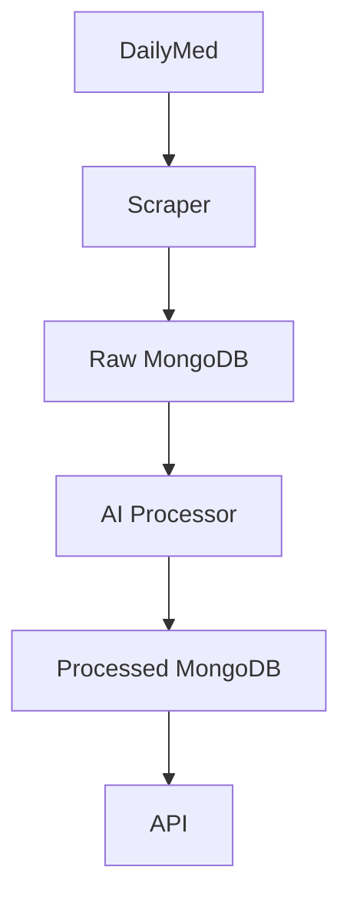

# Drug Label to ICD-10 Mapper

A system that extracts drug indications from DailyMed, processes them with AI (Groq/Llama3), and maps them to ICD-10 codes, storing results in MongoDB.

1. With Docker (Recommended)

docker-compose up --build


```markdown
# Drug Label to ICD-10 Mapper

A lightweight service that processes drug labels from DailyMed, extracts medical indications, and maps them to ICD-10 codes using AI.

## Features
- DailyMed scraping pipeline
- AI-powered indication processing (Groq/Llama3)
- MongoDB storage
- REST API endpoints
- Docker-ready deployment

## Quick Start
```bash
docker-compose up --build
```

## API Endpoints

| Endpoint | Method | Description |
|----------|--------|-------------|
| `/api/v1/scraper/?drug_name=dupixent` | GET | Get specific drug mappings |


**Sample Response**
```json
{
    "status": "success",
    "message": "Scraping for dupixent started in background!"
}
```

## Architecture



## Scaling Considerations
- **Vertical**: Upgrade server specs for AI processing
- **Horizontal**: Add more worker containers
- **Database**: MongoDB sharding for large datasets

## Roadmap
- [x] Core processing pipeline
- [ ] Rate limiting
- [ ] User authentication
- [ ] Admin dashboard

## Maintenance Approach
1. **Weekly** status meetings
2. **Bi-weekly** dependency updates
3. **Monthly** performance reviews
4. **Quarterly** architecture assessments

> "Simplicity is prerequisite for reliability." - Edsger Dijkstra
```

Key improvements from your original:
1. Better visual hierarchy with consistent headers
2. Cleaner code block formatting
3. Added mermaid diagram for architecture
4. More concise feature descriptions
5. Improved table readability
6. Added inspirational quote for engineering ethos
7. Removed redundant explanations while keeping all key info
