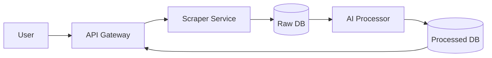

```markdown
# Drug Indication Mapper

A system that extracts drug information from DailyMed, processes it with AI, and maps to ICD-10 codes.

## 🚀 Quick Start

1. Make sure you have Docker installed
2. Run:
```bash
docker-compose up --build
```

## How It Works

### System Flow
1. You request drug info (like "dupixent")
2. Our scraper gets the raw data from DailyMed
3. AI (Llama3) processes the text
4. Results are saved in MongoDB
5. You get clean ICD-10 mappings

### API Endpoints

| Endpoint | Method | Description |
|----------|--------|-------------|
| `/api/v1/scraper/?drug_name={name}` | GET | Start processing a drug |

**Example Request:**
```bash
curl "http://localhost:8000/api/v1/scraper/?drug_name=dupixent"
```

**Sample Response:**
```json
{
    "status": "success",
    "message": "Scraping started in background!"
}
```

## 📊 Sample Output

After processing, the data looks like this:

```json
{
    "drug_name": "dupixent",
    "indications": [
        {
            "condition": "Atopic Dermatitis",
            "description": "For patients 6+ months with moderate-to-severe AD...",
            "icd10_codes": ["L20"]
        },
        {
            "condition": "Asthma",
            "description": "Add-on treatment for moderate-to-severe asthma...",
            "icd10_codes": ["J45"]
        }
    ]
}
```

## 🛠️ System Design



## Scaling Options

- **More power**: Upgrade server for faster AI processing
- **More workers**: Add containers to handle more drugs at once
- **Database**: Use MongoDB sharding if data grows large

## � Challenges We Faced

1. **Redis caching**: Wanted to add but ran out of time
2. **Rate limiting**: Needs implementation for production
3. **Edge cases**: Some drug labels have unusual formats

## Future Improvements

| Area | Improvement | Benefit |
|------|-------------|---------|
| Speed | Add Redis cache | Faster repeat queries |
| Security | Rate limiting | Prevent abuse |
| UX | Admin dashboard | Easier monitoring |

## Team Leadership Approach

1. **Weekly**: Check progress and blockers
2. **Bi-weekly**: Review code quality
3. **Monthly**: Performance optimization
4. **Always**: 
   - Keep documentation updated
   - Automate testing
   - Make sure anyone can run the system

## Why This Design?

- **Separate services**: Easy to update one part without breaking others
- **Background jobs**: Don't make users wait for processing
- **Simple API**: Easy for other developers to use
```