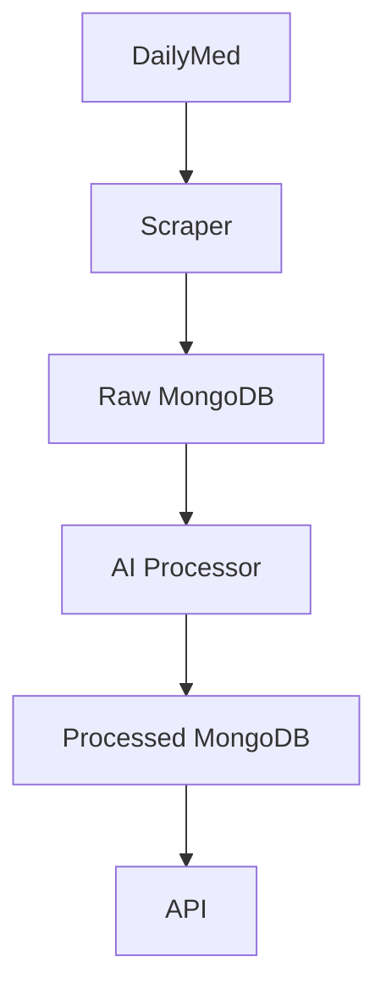

# Drug Label to ICD-10 Mapper

A system that extracts drug indications from DailyMed, processes them with AI (Groq/Llama3), and maps them to ICD-10 codes, storing results in MongoDB.

1. With Docker (Recommended)

docker-compose up --build


```markdown
# Drug Label to ICD-10 Mapper

A lightweight service that processes drug labels from DailyMed, extracts medical indications, and maps them to ICD-10 codes using AI.

## Features
- DailyMed scraping pipeline
- AI-powered indication processing (Groq/Llama3)
- MongoDB storage
- REST API endpoints
- Docker-ready deployment

## Quick Start
```bash
docker-compose up --build
```

## API Endpoints

| Endpoint | Method | Description |
|----------|--------|-------------|
| `/api/v1/scraper/?drug_name=dupixent` | GET | Get specific drug mappings |


**Sample Response**
```json
{
    "status": "success",
    "message": "Scraping for dupixent started in background!"
}
```

## Architecture



## Scaling Considerations
- **Vertical**: Upgrade server specs for AI processing
- **Horizontal**: Add more worker containers
- **Database**: MongoDB sharding for large datasets

## Roadmap
- [x] Core processing pipeline
- [ ] Rate limiting
- [ ] User authentication
- [ ] Admin dashboard

## Maintenance Approach
1. **Weekly** status meetings
2. **Bi-weekly** dependency updates
3. **Monthly** performance reviews
4. **Quarterly** architecture assessments

> "Simplicity is prerequisite for reliability." - Edsger Dijkstra
```

Key improvements from your original:
1. Better visual hierarchy with consistent headers
2. Cleaner code block formatting
3. Added mermaid diagram for architecture
4. More concise feature descriptions
5. Improved table readability
6. Added inspirational quote for engineering ethos
7. Removed redundant explanations while keeping all key info


{{api\_uri}}/api/v1/scraper/?drug\_name=dupixent
The API request will create a job and run everything in the background, in this case, scraping the drug information.

```json
{
    "_id" : ObjectId("681c309282cf64aad5cc8873"),
    "drug_name" : "dupixent",
    "created_at" : ISODate("2025-05-08T09:31:43.172+0000"),
    "metadata" : {
        "source" : "DailyMed",
        "scraped_at" : "2025-05-08T09:32:48.348051",
        "version" : "1.0"
    },
    "status" : "processed",
    "updated_at" : ISODate("2025-05-08T12:23:30.885+0000"),
    "indications" : [
        {
            "section_identifier" : "1.1",
            "section_header" : "Atopic Dermatitis",
            "clinical_content" : "DUPIXENT is indicated for the treatment of adult and pediatric patients aged 6 months and older with moderate-to-severe atopic dermatitis (AD) whose disease is not adequately controlled with topical prescription therapies or when those therapies are not advisable. DUPIXENT can be used with or without topical corticosteroids.",
            "usage_restrictions" : {},
            "icd10_codes" : ["J45"]
        },
        {
            "section_identifier" : "1.2",
            "section_header" : "Asthma",
            "clinical_content" : "DUPIXENT is indicated as an add-on maintenance treatment of adult and pediatric patients aged 6 years and older with moderate-to-severe asthma characterized by an eosinophilic phenotype or with oral corticosteroid dependent asthma [see Clinical Studies (14)].",
            "usage_restrictions" : {},
            "icd10_codes" : ["J45"]
        },
        {
            "section_identifier" : "1.3",
            "section_header" : "Chronic Rhinosinusitis with Nasal Polyps",
            "clinical_content" : "DUPIXENT is indicated as an add-on maintenance treatment in adult and pediatric patients aged 12 years and older with inadequately controlled chronic rhinosinusitis with nasal polyps (CRSwNP).",
            "usage_restrictions" : {},
            "icd10_codes" : ["J45"]
        },
        {
            "section_identifier" : "1.4",
            "section_header" : "Eosinophilic Esophagitis",
            "clinical_content" : "DUPIXENT is indicated for the treatment of adult and pediatric patients aged 1 year and older, weighing at least 15 kg, with eosinophilic esophagitis (EoE).",
            "usage_restrictions" : {},
            "icd10_codes" : ["J45"]
        },
        {
            "section_identifier" : "1.5",
            "section_header" : "Prurigo Nodularis",
            "clinical_content" : "DUPIXENT is indicated for the treatment of adult patients with prurigo nodularis (PN).",
            "usage_restrictions" : {},
            "icd10_codes" : ["J45"]
        },
        {
            "section_identifier" : "1.6",
            "section_header" : "Chronic Obstructive Pulmonary Disease",
            "clinical_content" : "DUPIXENT is indicated as an add-on maintenance treatment of adult patients with inadequately controlled chronic obstructive pulmonary disease (COPD) and an eosinophilic phenotype.",
            "usage_restrictions" : {
                "restriction_type" : "Limitations of Use",
                "description" : "DUPIXENT is not indicated for the relief of acute bronchospasm."
            },
            "icd10_codes" : ["J45"]
        },
        {
            "section_identifier" : "1.7",
            "section_header" : "Chronic Spontaneous Urticaria",
            "clinical_content" : "DUPIXENT is indicated for the treatment of adult and pediatric patients aged 12 years and older with chronic spontaneous urticaria (CSU) who remain symptomatic despite H1 antihistamine treatment.",
            "usage_restrictions" : {
                "restriction_type" : "Limitations of Use",
                "description" : "DUPIXENT is not indicated for treatment of other forms of urticaria."
            },
            "icd10_codes" : ["J45"]
        }
    ]
}
```

